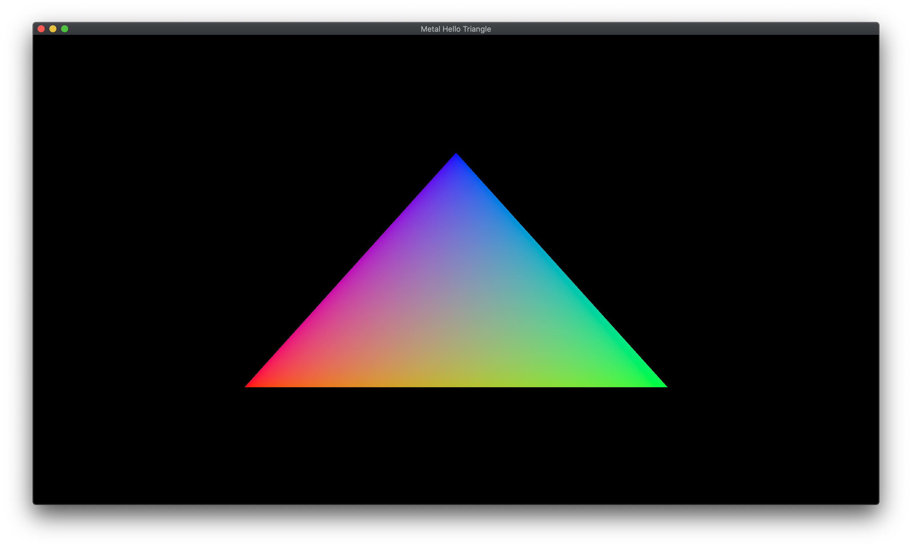

# Metal Hello Triangle

The classical Hello Triangle Application with **Metal**, running under macOS.
No storyboard, only programmatic files.

[Metal Documentation](https://developer.apple.com/documentation/metal) — [MetalKit Documentation](https://developer.apple.com/documentation/metalkit) — [Metal Shading Language Specification](https://developer.apple.com/metal/Metal-Shading-Language-Specification.pdf)

